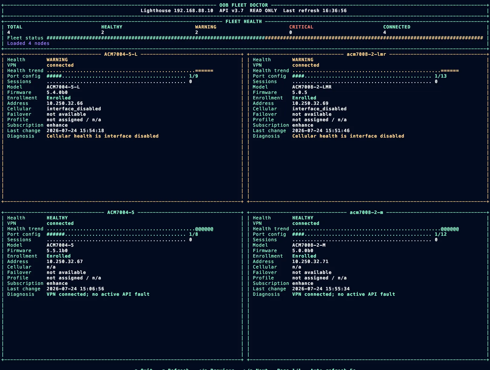

# Opengear Lighthouse Lab

This repository contains notes and read-only diagnostic tools for an Opengear
Lighthouse lab deployed on Proxmox VE.

## Install Lighthouse on Proxmox VE

Run the following commands from the Proxmox host as a user with permission to
manage virtual machines.

### 1. Check the network bridge

Confirm that the bridge intended for the VM exists. The example below uses
`vmbr0`.

```sh
ip link show | grep vmbr
```

### 2. Check available storage

```sh
pvesm status
```

Note the storage ID that will hold the imported Lighthouse disk. In this
example, the image is imported into `local`.

### 3. Create the virtual machine

This example uses VM ID `444`, 4 GiB of memory, four CPU cores, and a VirtIO
network adapter connected to `vmbr0`.

```sh
qm create 444 \
  --name lighthouse \
  --memory 4096 \
  --cores 4 \
  --net0 virtio,bridge=vmbr0
```

VM IDs must be unique. Change `444` if it is already in use.

### 4. Download the Lighthouse disk image

```sh
wget https://ftp.opengear.com/download/lighthouse_software/current/lighthouse/lighthouse-26.04.4.qcow2
```

### 5. Import the disk

```sh
qm importdisk 444 lighthouse-26.04.4.qcow2 local --format qcow2
```

If the target storage is not named `local`, replace it with the appropriate
storage ID from `pvesm status`.

### 6. Identify and attach the imported disk

Inspect the VM configuration:

```sh
qm config 444
```

A newly imported disk normally appears as `unused0`. Attach the exact volume
shown by `qm config`. For the original lab layout, the commands were:

```sh
qm set 444 --scsihw virtio-scsi-pci --scsi0 local-lvm:vm-444-disk-0
qm set 444 --boot order=scsi0
```

The storage and volume in `--scsi0` must match the imported disk. For example,
if `qm config 444` shows:

```text
unused0: local:444/vm-444-disk-0.qcow2
```

attach that volume instead:

```sh
qm set 444 --scsihw virtio-scsi-pci \
  --scsi0 local:444/vm-444-disk-0.qcow2
qm set 444 --boot order=scsi0
```

### 7. Verify and start the VM

```sh
qm config 444
qm start 444
```

The final configuration should show four cores, 4096 MiB of memory, `vmbr0`,
the imported disk on `scsi0`, and `boot: order=scsi0`.

## Fleet Doctor

`fleetdoctor.py` provides a read-only Lighthouse node inventory, while
`fleetdoctor_dashboard.py` displays the same information in a live terminal
dashboard.

See [README-fleetdoctor.md](README-fleetdoctor.md) for the short usage guide.
